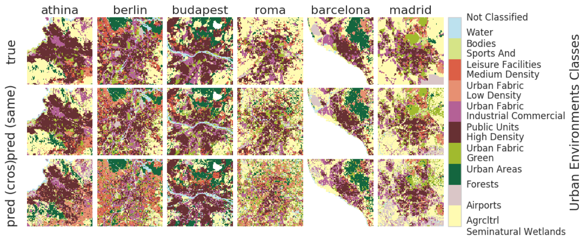

# Comparing urban environments using satellite imagery and convolutional neural networks

This repository contains code related to the paper [Using convolutional networks and satellite imagery to identify patterns in urban environments at a large scale](https://arxiv.org/abs/1704.02965). A slightly modified version of the paper appears in the [proceedings](http://www.kdd.org/kdd2017/papers/view/using-convolutional-networks-and-satellite-imagery-to-identify-patterns-in-) of the [ACM KDD 2017](http://www.kdd.org/kdd2017/) conference.

If you use the code, data, or analysis results in this paper, we kindly ask that you cite the paper above as:

> _Using convolutional networks and satellite imagery to identify patterns in urban environments at a large scale_. A. Toni Albert, J. Kaur, M.C. Gonzalez, 2017. In Proceedings of the ACM SigKDD 2017 Conference, Halifax, Nova Scotia, Canada.

This repository contains the `Python` implementation of the data processing, model training, and analysis presented in the paper:

* code to construct training and evaluation datasets for land use classification of urban environments is in the [dataset-collection](./dataset-collection) folder
* `Keras` implementations of the convolutional neural networks classifiers used for this paper are in the [classifier](./classifier) folder, along with `Keras` utilities for data ingestion and multi-GPU training (with a `TensorFlow` backend)
* code to train and validate the models, and to produce the analysis and figures in the paper is in the notebooks in the [land-use-classification](./land-use-classification) folder.
