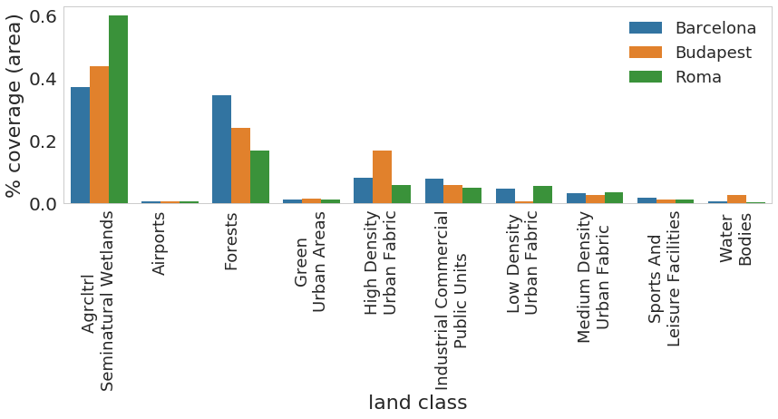
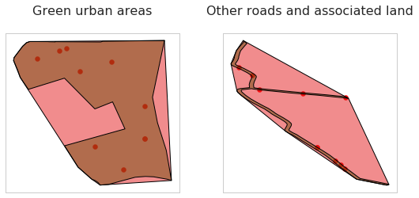
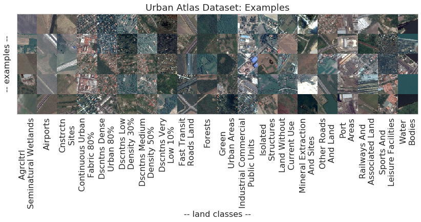

## Creating the _Urban Environments_ dataset

To build a consistent satellite and GIS data ingestion pipeline, we have developed, and made extensive use of, the `pysatml`  module in `Python`. The development page for that package can be found [here](https://github.com/adrianalbert/pysatml). That page offers more details and tutorials on how to use that module to streamline the processing and ingestion of typical raster and vector data formats that are common in remote-sensing and GIS data analysis. You can simply install the `pysatml` module via `pip`:

```bash
pip install pysatml
```

To construct training and validation datasets, we combine ground-truth labels from the [Urban Atlas](http://www.eea.europa.eu/data-and-maps/data/urban-atlas.) large-scale land use classification survey with satellite imagery obtained from [Google Maps](https://developers.google.com/maps/documentation/javascript/get-api-key). Our process consists of the following three main steps:
* Downloading land use survey files from Urban Atlas at [this link](http://www.eea.europa.eu/data-and-maps/data/urban-atlas). Unfortunately, this first step is a manual process. 
* Generating an appropriate list of locations - as (lat,lon) tuples - where to sample satellite imagery
* Downloading satellite imagery from Google Maps Static API ([API key needed](https://developers.google.com/maps/documentation/javascript/get-api-key))

We plan to make the actual dataset available after further curation and ensuring that this complies with all applicable data licenses of the dataset used. In the meantime, we describe below the detailed procedure used to construct this dataset. 

The entire pipeline is implemented and documented in this [notebook](./dataset-collection/Pipeline-to-create-Urban-Environments-dataset.ipynb).

#### Obtaining shape files for ground truth labels
First, manually download GIS polygon data for ground truth, available as shapefiles at [the Urban Atlas website](http://www.eea.europa.eu/data-and-maps/data/urban-atlas). Unfortunately there is no way to automate this because of the confirmation web forms used on the Urban Atlas website. 

You can save these shapefiles (along with their respective projection files) to `/home/data/urban-atlas/shapefiles/`, or to a folder of your choosing, and manually edit the paths in the notebook.

The paper uses the shapefiles for several cities, some of which are expected to be more "similar" to each other than others. We have experimented with data for several other cities, however we decided to only include the following six cities in the analysis in the paper:
* Athens
* Barcelona
* Berlin
* Madrid
* Budapest 
* Roma 

#### Ingesting and processing _Urban Atlas_ shapefiles
To process the vector data (shapefiles), we have developed the `UAShapeFile` class that encapsulates much of the functionality needed for shapefile data ingestion, sampling, etc. See the code in the [urbanatlas](./urbanatlas) folder. This is a lighweight wrapper around a ```GeoDataFrame``` object from the ```geopandas``` Python module. A sample usage is as follows:

```Python
>>> from urbanatlas import UAShapeFile
>>> myshapefile = "ro001l_bucharest.shp"
>>> mycity = UAShapeFile(myshapefile)
```

Let's look at the amount of land classified by each land use class across three example cities.



As expected, there is a large disparity in the classes, with a lot more land (by surface) classified as agricultural or forests as opposed to, e.g., airports. In the figure, we show the land use classes we analyze in the [paper](https://arxiv.org/abs/1704.02965).

#### Creating ground truth validation raster grids

First, let's crop a window of width W x W (in km) centered at the city center:

```Python
>>> W = 25 # in Km
>>> window = (W, W)
>>> mycity_crop = mycity.crop_centered_window(city_center, window)
```
                    
The `UAShapeFile` class allows to compute a ground raster of a given grid size:
```Python
>>> grid_cell = 100
>>> grid_size = (grid_cell, grid_cell)
>>> raster, locations_grid, cur_classes = mycity_crop.extract_class_raster(grid_size=grid_size)
```
    
This step can be skipped in the case of the six cities above, for which the data (files ```sample_locations_raster.csv``` and ```ground_truth_class_raster.npz```) can be found in this repository under [processed-data](./processed-data).

#### Selecting appropriate samples

Now, let's generate locations to download imagery for from the shapefile, using a stratified sampling procedure that takes into account the imbalances in the classes.

```Python
>>> N_SAMPLES_PER_CLASS = 1250
>>> MAX_SAMPLES_PER_POLY = 50
>>> locations_train = mycity.generate_sampling_locations(thresh_area=thresh_area, \
                                                     n_samples_per_class=N_SAMPLES_PER_CLASS,\
                                                     max_samples=MAX_SAMPLES_PER_POLY)
```

This step can be skipped in the case of the six cities above, for which the data (files ```additional_sample_locations.csv```) can be found in this repository under [processed-data](./processed-data).

An example of polygon data and sampling locations is given in the below figure. 



#### Downloading satellite imagery

With a list of locations to sample (and their respective classes), we can now acquire imagery at each of the locations. There are a number of different ways to go about it, depending, of course, on the type and characteristics of the imagery needed. For visual-spectrum imagery, perhaps the easiest-to-use online source is Google Maps. For this, there are two steps to follow:

1. Create a Google Maps [Static API key](https://developers.google.com/maps/documentation/javascript/get-api-key)
2. Edit and run this [Jupyter notebook](./dataset-collection/Urban%20Atlas%20-%20extract%20images.ipynb) in the [dataset-collection](./dataset-collection) folder.

Example satellite images across the 20 original classes in the _Urban Atlas_ survey is given in the figure below.




